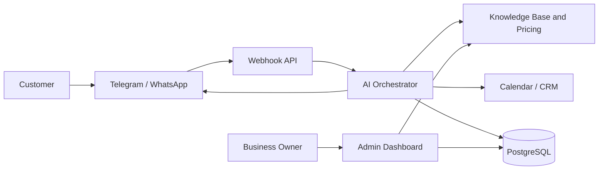

# MVP Plan: AI Assistant for Local Businesses

## 1. MVP Goal

Validate whether local businesses are willing to pay for an AI administrator that accepts inbound messages, answers from an approved knowledge base, qualifies the customer, and creates bookings without human involvement.

30-day success criteria:

- 10 connected pilot businesses.
- 3 paying customers after the pilot.
- At least 60% of conversations are resolved without human intervention.
- Average first-response time under 10 seconds.

## 2. User Scenarios

### End Customer

1. Sends a message in Telegram or WhatsApp.
2. Receives a greeting and answers about services.
3. Selects a service, staff member, and convenient time.
4. Receives booking confirmation and a reminder.

### Business Owner

1. Provides pricing, schedule, address, cancellation rules, and FAQ.
2. Gets access to a dashboard for leads and conversations.
3. Reviews bookings, leads, escalated conversations, and statistics.
4. Can disable the assistant or hand a conversation over to a human.

## 3. MVP Architecture



### Components

- Landing: Next.js, lead form, analytics events.
- Admin Dashboard: business settings, services, schedule, conversations, and leads.
- Webhook API: receives messages from Telegram and WhatsApp.
- AI Orchestrator: prompt assembly, tool selection, guardrails, database writes.
- Knowledge Base: pricing, FAQ, business rules, addresses, staff members.
- Integrations Layer: Telegram Bot API, WhatsApp Business Cloud API, Google Calendar, CRM.
- Database: PostgreSQL for customers, conversations, bookings, and settings.
- Queue/Jobs: background jobs for reminders and follow-ups.

## 4. Recommended Stack

- Frontend: Next.js, React, TypeScript, Tailwind CSS.
- Backend: Next.js Route Handlers for the MVP, or a separate Node.js service with NestJS/Fastify after validation.
- Database: PostgreSQL + Prisma.
- Cache/Queue: Redis + BullMQ or a managed queue provider.
- AI: OpenAI/Azure OpenAI API with function calling/tools.
- Messaging: Telegram Bot API, WhatsApp Business Cloud API.
- Calendar: Google Calendar API for the first version.
- Hosting: Vercel for the landing page, Render/Fly.io/Azure Container Apps for backend, or a single Next.js deployment.
- Observability: Sentry, structured logs, basic product analytics.

## 5. Database

Minimal PostgreSQL schema:

```sql
create table businesses (
  id uuid primary key,
  name text not null,
  segment text not null,
  timezone text not null default 'Europe/Moscow',
  created_at timestamptz not null default now()
);

create table channels (
  id uuid primary key,
  business_id uuid not null references businesses(id),
  type text not null check (type in ('telegram', 'whatsapp')),
  external_id text not null,
  access_token text,
  is_active boolean not null default true,
  created_at timestamptz not null default now()
);

create table services (
  id uuid primary key,
  business_id uuid not null references businesses(id),
  name text not null,
  description text,
  price_from integer,
  duration_minutes integer not null,
  is_active boolean not null default true
);

create table staff_members (
  id uuid primary key,
  business_id uuid not null references businesses(id),
  name text not null,
  role text,
  is_active boolean not null default true
);

create table customers (
  id uuid primary key,
  business_id uuid not null references businesses(id),
  name text,
  phone text,
  messenger_user_id text,
  created_at timestamptz not null default now()
);

create table conversations (
  id uuid primary key,
  business_id uuid not null references businesses(id),
  customer_id uuid references customers(id),
  channel_id uuid not null references channels(id),
  status text not null check (status in ('open', 'booked', 'handoff', 'closed')),
  created_at timestamptz not null default now(),
  updated_at timestamptz not null default now()
);

create table messages (
  id uuid primary key,
  conversation_id uuid not null references conversations(id),
  sender text not null check (sender in ('customer', 'assistant', 'admin', 'system')),
  body text not null,
  created_at timestamptz not null default now()
);

create table bookings (
  id uuid primary key,
  business_id uuid not null references businesses(id),
  customer_id uuid not null references customers(id),
  service_id uuid references services(id),
  staff_member_id uuid references staff_members(id),
  starts_at timestamptz not null,
  ends_at timestamptz not null,
  status text not null check (status in ('pending', 'confirmed', 'cancelled', 'completed')),
  external_calendar_event_id text,
  created_at timestamptz not null default now()
);

create table knowledge_items (
  id uuid primary key,
  business_id uuid not null references businesses(id),
  title text not null,
  content text not null,
  kind text not null check (kind in ('faq', 'policy', 'address', 'promo', 'other')),
  created_at timestamptz not null default now()
);
```

## 6. MVP API

### Public API

- `POST /api/leads` - landing-page lead submission.
- `POST /api/webhooks/telegram` - inbound Telegram messages.
- `POST /api/webhooks/whatsapp` - inbound WhatsApp messages.

### Admin API

- `GET /api/businesses/:id` - business profile.
- `PATCH /api/businesses/:id` - update business settings.
- `GET /api/services?businessId=` - list services.
- `POST /api/services` - create a service.
- `PATCH /api/services/:id` - update a service.
- `GET /api/conversations?businessId=` - list conversations.
- `GET /api/conversations/:id/messages` - message history.
- `POST /api/conversations/:id/handoff` - hand over to a human.
- `GET /api/bookings?businessId=` - list bookings.
- `POST /api/bookings` - create a booking.
- `PATCH /api/bookings/:id` - update booking status.
- `POST /api/knowledge` - add an item to the knowledge base.

### AI Tools

Tools the model is allowed to call:

- `get_services(businessId)` - get the current price list.
- `get_available_slots(serviceId, staffMemberId, dateRange)` - find available time slots.
- `create_booking(customer, serviceId, staffMemberId, startsAt)` - create a booking.
- `handoff_to_admin(reason)` - hand the conversation over to a human.
- `apply_first_visit_discount()` - apply a 10% first-visit discount when a customer hesitates.

## 7. Agent Prompt

Base system prompt:

```text
You are a professional administrator for a local business.
Your task is to greet the customer politely, answer questions strictly from the price list and knowledge base, find available time slots, and create bookings.

Rules:
- Do not invent services, prices, discounts, staff members, or available slots.
- If information is missing, ask a clarifying question or hand the conversation over to an administrator.
- If the customer hesitates, offer a 10% first-visit discount once, only if this is allowed by business settings.
- Before creating a booking, confirm the service, date, time, name, and phone number.
- If the customer is aggressive, asks for non-standard terms, or asks a legally/medically risky question, hand the conversation over to a human.
```

## 8. Integrations

### Telegram

- Create a bot through BotFather.
- Store the bot token in secrets.
- Configure the webhook at `/api/webhooks/telegram`.
- Normalize inbound messages into a shared `InboundMessage` format.
- Send replies through `sendMessage`.

### WhatsApp

- Create a Meta Business App.
- Connect WhatsApp Business Cloud API.
- Complete webhook verification.
- Store `phone_number_id`, `verify_token`, and `access_token`.
- Normalize inbound messages into the same `InboundMessage` format.

### CRM and Calendar

Google Calendar is enough for the MVP:

- One calendar per business or separate calendars per staff member.
- Availability checks through the FreeBusy API.
- Event creation after booking confirmation.
- Store `external_calendar_event_id` in the `bookings` table.

After demand is validated, add CRM integrations:

- AmoCRM: contacts, deals, tasks.
- Bitrix24: leads, deals, activities.
- YCLIENTS/Altegio: especially relevant for beauty salons.

## 9. Security and Legal Requirements

- Encrypt channel and CRM tokens at the database level or in a secrets store.
- Store the minimum necessary personal data.
- Add consent for personal data processing for the business owner.
- Log assistant actions: created bookings, discounts, handoffs.
- Do not use customer conversations for training without separate consent.
- Add rate limiting to webhook and admin APIs.

## 10. Development Plan

### Week 1

- Landing page and lead form.
- Basic database: businesses, services, customers, conversations, messages, bookings.
- Telegram webhook.
- First AI orchestrator with tools: pricing, slots, booking creation.

### Week 2

- Google Calendar integration.
- Admin dashboard: services, conversations, bookings.
- Human handoff.
- Logs and basic analytics.

### Week 3

- WhatsApp Business Cloud API.
- Customer reminders.
- FAQ/price import from a spreadsheet.
- Connect the first 3-5 pilot businesses.

### Week 4

- Improve the prompt based on real conversations.
- Reports for business owners.
- Prepare pricing and packaging.
- Decide whether to scale, change the segment, or stop the hypothesis.

## 11. MVP Metrics

- Number of inbound conversations.
- Share of automated replies without handoff.
- Share of conversations that end with a booking.
- Average response time.
- Number of errors: wrong price, wrong time, unconfirmed booking.
- AI cost per conversation.
- Pilot-to-paid conversion rate.

## 12. Risks

- WhatsApp verification may take longer, so Telegram should launch first.
- Scheduling mistakes are critical for trust, so booking creation must only happen through a verified tool.
- Different businesses have different rules, so the knowledge base must be structured, not just free-form text.
- Cold outreach can have low conversion and legal risks, so it should be combined with manual outreach and warm demos.
