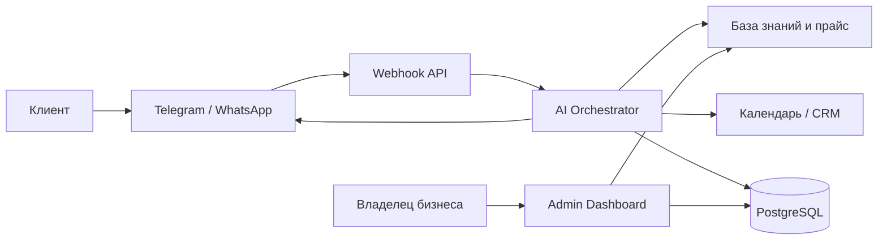

# MVP-план: AI-Ассистент для локального бизнеса

## 1. Цель MVP

Проверить, готов ли локальный бизнес платить за ИИ-администратора, который принимает входящие сообщения, отвечает по базе знаний, квалифицирует клиента и создает запись без участия человека.

Критерий успеха на 30 дней:

- 10 подключенных тестовых бизнесов.
- 3 платящих клиента после пилота.
- Не менее 60% диалогов закрываются без вмешательства человека.
- Среднее время первого ответа менее 10 секунд.

## 2. Пользовательские сценарии

### Клиент бизнеса

1. Пишет в Telegram или WhatsApp.
2. Получает приветствие и ответы на вопросы по услугам.
3. Выбирает услугу, мастера и удобное время.
4. Получает подтверждение записи и напоминание.

### Владелец бизнеса

1. Передает прайс, расписание, адрес, правила отмены и FAQ.
2. Получает доступ к панели заявок и диалогов.
3. Видит записи, лиды, спорные диалоги и статистику.
4. Может отключить ассистента или передать диалог человеку.

## 3. Архитектура MVP



### Компоненты

- Landing: Next.js, форма заявки, события аналитики.
- Admin Dashboard: управление бизнесом, услугами, расписанием, диалогами и лидами.
- Webhook API: прием сообщений из Telegram и WhatsApp.
- AI Orchestrator: промпт, выбор инструментов, проверка ограничений, запись в БД.
- Knowledge Base: прайс, FAQ, правила бизнеса, адреса, мастера.
- Integrations Layer: Telegram Bot API, WhatsApp Business Cloud API, Google Calendar, CRM.
- Database: PostgreSQL для клиентов, диалогов, записей и настроек.
- Queue/Jobs: фоновые задачи для напоминаний и повторных касаний.

## 4. Рекомендуемый стек

- Frontend: Next.js, React, TypeScript, Tailwind CSS.
- Backend: Next.js Route Handlers или отдельный Node.js сервис на NestJS/Fastify после MVP.
- Database: PostgreSQL + Prisma.
- Cache/Queue: Redis + BullMQ или managed очередь провайдера.
- AI: OpenAI/Azure OpenAI API с function calling/tools.
- Messaging: Telegram Bot API, WhatsApp Business Cloud API.
- Calendar: Google Calendar API на первом этапе.
- Hosting: Vercel для лендинга, Render/Fly.io/Azure Container Apps для backend или единый Next.js deploy.
- Observability: Sentry, structured logs, basic product analytics.

## 5. База данных

Минимальная схема PostgreSQL:

```sql
create table businesses (
  id uuid primary key,
  name text not null,
  segment text not null,
  timezone text not null default 'Europe/Moscow',
  created_at timestamptz not null default now()
);

create table channels (
  id uuid primary key,
  business_id uuid not null references businesses(id),
  type text not null check (type in ('telegram', 'whatsapp')),
  external_id text not null,
  access_token text,
  is_active boolean not null default true,
  created_at timestamptz not null default now()
);

create table services (
  id uuid primary key,
  business_id uuid not null references businesses(id),
  name text not null,
  description text,
  price_from integer,
  duration_minutes integer not null,
  is_active boolean not null default true
);

create table staff_members (
  id uuid primary key,
  business_id uuid not null references businesses(id),
  name text not null,
  role text,
  is_active boolean not null default true
);

create table customers (
  id uuid primary key,
  business_id uuid not null references businesses(id),
  name text,
  phone text,
  messenger_user_id text,
  created_at timestamptz not null default now()
);

create table conversations (
  id uuid primary key,
  business_id uuid not null references businesses(id),
  customer_id uuid references customers(id),
  channel_id uuid not null references channels(id),
  status text not null check (status in ('open', 'booked', 'handoff', 'closed')),
  created_at timestamptz not null default now(),
  updated_at timestamptz not null default now()
);

create table messages (
  id uuid primary key,
  conversation_id uuid not null references conversations(id),
  sender text not null check (sender in ('customer', 'assistant', 'admin', 'system')),
  body text not null,
  created_at timestamptz not null default now()
);

create table bookings (
  id uuid primary key,
  business_id uuid not null references businesses(id),
  customer_id uuid not null references customers(id),
  service_id uuid references services(id),
  staff_member_id uuid references staff_members(id),
  starts_at timestamptz not null,
  ends_at timestamptz not null,
  status text not null check (status in ('pending', 'confirmed', 'cancelled', 'completed')),
  external_calendar_event_id text,
  created_at timestamptz not null default now()
);

create table knowledge_items (
  id uuid primary key,
  business_id uuid not null references businesses(id),
  title text not null,
  content text not null,
  kind text not null check (kind in ('faq', 'policy', 'address', 'promo', 'other')),
  created_at timestamptz not null default now()
);
```

## 6. API MVP

### Public API

- `POST /api/leads` - заявка с лендинга.
- `POST /api/webhooks/telegram` - входящие Telegram-сообщения.
- `POST /api/webhooks/whatsapp` - входящие WhatsApp-сообщения.

### Admin API

- `GET /api/businesses/:id` - карточка бизнеса.
- `PATCH /api/businesses/:id` - обновление настроек.
- `GET /api/services?businessId=` - список услуг.
- `POST /api/services` - создать услугу.
- `PATCH /api/services/:id` - обновить услугу.
- `GET /api/conversations?businessId=` - список диалогов.
- `GET /api/conversations/:id/messages` - история сообщений.
- `POST /api/conversations/:id/handoff` - передать человеку.
- `GET /api/bookings?businessId=` - список записей.
- `POST /api/bookings` - создать запись.
- `PATCH /api/bookings/:id` - изменить статус записи.
- `POST /api/knowledge` - добавить материал в базу знаний.

### AI Tools

Инструменты, которые модель может вызывать:

- `get_services(businessId)` - получить актуальный прайс.
- `get_available_slots(serviceId, staffMemberId, dateRange)` - найти свободное время.
- `create_booking(customer, serviceId, staffMemberId, startsAt)` - создать запись.
- `handoff_to_admin(reason)` - передать диалог человеку.
- `apply_first_visit_discount()` - применить скидку 10% при сомнении клиента.

## 7. Промпт агента

Базовый system prompt:

```text
Ты - профессиональный администратор локального бизнеса.
Твоя задача - вежливо приветствовать клиента, отвечать на вопросы строго по прайсу и базе знаний, подбирать свободное время и фиксировать запись.

Правила:
- Не придумывай услуги, цены, скидки, мастеров и свободные окна.
- Если данных нет, уточни вопрос или передай диалог администратору.
- Если клиент сомневается, один раз предложи скидку 10% на первый визит, если это разрешено настройками бизнеса.
- Перед созданием записи подтверди услугу, дату, время, имя и телефон.
- Если клиент грубит, требует нестандартных условий или задает юридически/медицински рискованный вопрос, передай диалог человеку.
```

## 8. Интеграции

### Telegram

- Создать бота через BotFather.
- Сохранить bot token в секретах.
- Настроить webhook на `/api/webhooks/telegram`.
- Нормализовать входящие сообщения в общий формат `InboundMessage`.
- Отправлять ответы через `sendMessage`.

### WhatsApp

- Создать Meta Business App.
- Подключить WhatsApp Business Cloud API.
- Пройти верификацию webhook.
- Сохранить `phone_number_id`, `verify_token`, `access_token`.
- Нормализовать входящие сообщения в тот же `InboundMessage`.

### CRM и календарь

Для MVP достаточно Google Calendar:

- Один календарь на бизнес или отдельные календари по мастерам.
- Проверка занятости через FreeBusy API.
- Создание события после подтверждения записи.
- Хранение `external_calendar_event_id` в таблице `bookings`.

После проверки спроса добавить CRM-интеграции:

- AmoCRM: контакты, сделки, задачи.
- Bitrix24: лиды, сделки, активности.
- YCLIENTS/Altegio: актуально для салонов красоты.

## 9. Безопасность и юридические требования

- Шифровать токены каналов и CRM на уровне БД или secrets-хранилища.
- Хранить минимальный набор персональных данных.
- Добавить согласие на обработку персональных данных для владельца бизнеса.
- Логировать действия ассистента: созданные записи, скидки, handoff.
- Не использовать диалоги клиентов для обучения без отдельного согласия.
- Добавить rate limiting на webhook и admin API.

## 10. План разработки

### Неделя 1

- Лендинг и форма заявки.
- Базовая БД: businesses, services, customers, conversations, messages, bookings.
- Telegram webhook.
- Первый AI orchestrator с tools: прайс, слоты, создание записи.

### Неделя 2

- Google Calendar интеграция.
- Admin dashboard: услуги, диалоги, записи.
- Handoff человеку.
- Логи и базовая аналитика.

### Неделя 3

- WhatsApp Business Cloud API.
- Напоминания клиентам.
- Импорт FAQ/прайса из таблицы.
- Подключение первых 3-5 пилотных бизнесов.

### Неделя 4

- Улучшение промпта по реальным диалогам.
- Отчеты для владельца бизнеса.
- Подготовка тарификации.
- Решение о продолжении: масштабировать, менять сегмент или закрывать гипотезу.

## 11. Метрики MVP

- Количество входящих диалогов.
- Доля автоматических ответов без handoff.
- Доля диалогов, завершенных записью.
- Среднее время ответа.
- Количество ошибок: неверная цена, неверное время, неподтвержденная запись.
- Стоимость AI на один диалог.
- Конверсия пилота в оплату.

## 12. Риски

- WhatsApp может дольше проходить верификацию, поэтому Telegram лучше запускать первым.
- Ошибки в расписании критичны для доверия, поэтому создание записи должно идти только через проверенный tool.
- У разных бизнесов разные правила, поэтому база знаний должна быть структурированной, а не только текстовой.
- Холодные рассылки могут давать низкую конверсию и юридические риски, лучше совмещать с ручным outreach и теплой демонстрацией.
