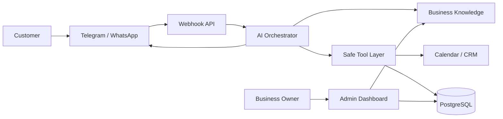

# Architecture

This document describes the target MVP architecture for the AI Local Business Assistant.

## Goals

- Accept inbound messages from Telegram and WhatsApp.
- Answer only from approved business knowledge: services, prices, policies, locations, and FAQ.
- Book customers into a calendar or CRM after explicit confirmation.
- Escalate risky or unclear conversations to a human administrator.
- Keep the system auditable and safe for healthcare-adjacent administrative use cases.

## High-Level Flow

## Components

- Landing: public website that explains the product and collects leads.
- Admin Dashboard: business settings, services, knowledge base, conversations, and bookings.
- Webhook API: validates and normalizes incoming messages from Telegram and WhatsApp.
- AI Orchestrator: builds the prompt, calls approved tools, and applies safety rules.
- Safe Tool Layer: performs deterministic actions such as reading services, checking slots, and creating bookings.
- Knowledge Base: structured business data, FAQ, policies, and safety boundaries.
- Database: PostgreSQL for businesses, customers, conversations, messages, bookings, services, and audit logs.
- Jobs: reminders, follow-ups, retries, and background synchronization.

## Safety Boundaries

The assistant must not directly modify customer-impacting state without tool validation. For example, it cannot invent a free time slot; it must call `get_available_slots`. It cannot claim that a booking exists unless `create_booking` succeeds.

Healthcare-adjacent scenarios must be administrative only. The assistant may help with appointment booking, clinic hours, document lists, and routing. It must not diagnose symptoms, recommend treatment, or discourage emergency care.

## Data Model Summary

- `businesses`: organization profile and configuration.
- `channels`: Telegram/WhatsApp channel credentials and identifiers.
- `services`: approved services, duration, pricing, and availability.
- `staff_members`: providers, masters, doctors, or administrators.
- `customers`: minimal customer profile and contact identifiers.
- `conversations`: message threads and current state.
- `messages`: raw and normalized message history.
- `bookings`: appointments and external calendar event IDs.
- `knowledge_items`: FAQ, policy, location, promotion, and safety content.

## Planned API Surface

- `POST /api/leads`
- `POST /api/webhooks/telegram`
- `POST /api/webhooks/whatsapp`
- `GET /api/conversations`
- `GET /api/conversations/:id/messages`
- `POST /api/conversations/:id/handoff`
- `GET /api/bookings`
- `POST /api/bookings`
- `GET /api/services`
- `POST /api/services`
- `POST /api/knowledge`

## AI Tools

- `get_services(businessId)`
- `get_available_slots(serviceId, staffMemberId, dateRange)`
- `create_booking(customer, serviceId, staffMemberId, startsAt)`
- `handoff_to_admin(reason)`
- `apply_first_visit_discount()`

## Deployment Target

The initial project can run as a single Next.js application. After the MVP validates demand, the webhook/orchestration layer can be separated into a backend service with a queue and dedicated worker processes.
